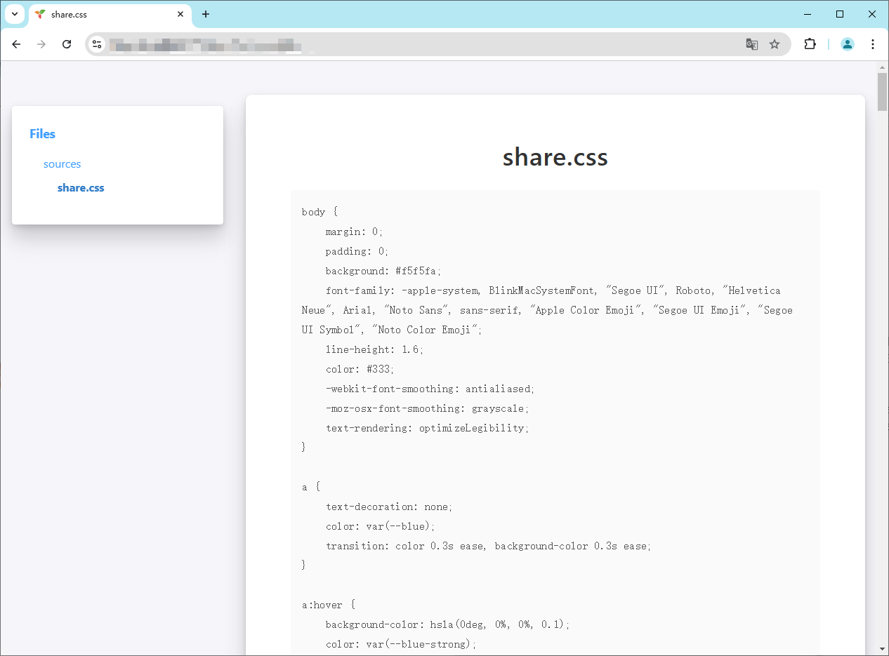

# Share.CSS

Trilium Note Share.CSS

# How to use

copy css/share.css and create a new note

clone this note into your Sharing Tree

add a ~shareCss relation to the share.css code note which will be linked in the shared page

in case you want this to apply to the whole subtree, don't forget to make the label inheritable

If you want to hide this css code note from left tree navigation, add #shareHiddenFromTree label to the CSS code note.

See the Trilium wiki for more information

# preview

